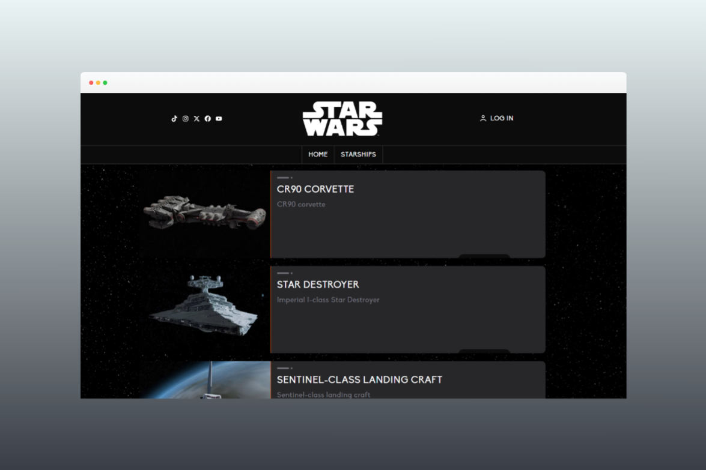

# Star Wars App



> A React web application that displays information about Star Wars starships by consuming data from the SWAPI. Features detailed ship information, pagination, and protected routes with Firebase authentication.

[](https://dracudev-star-wars.vercel.app/)
[](LICENSE.md)

## 📄 Description

This project involves creating a React web application that displays information about Star Wars ships by consuming data from an API. The app will show a list of ships with their essential details, and when clicked, it will display the detailed information of each ship. The project also implements pagination and protected routes for logged-in users.

The app is designed as part of a technical test for front-end developers in the e-commerce sector in Barcelona.

### Objectives

- Consume data from an external API.
- Display and manage paginated data.
- Enhance user experience with dynamic navigation and detailed views.
- Implement protected routes using authentication.
- Use Redux for state management.
- Utilize Tailwind CSS for styling and Storybook for component development.

<br>

## 💻 Technologies Used

- **Vite** for development and building the app.
- **React** and **React-DOM** for creating the component-based UI.
- **React Router DOM** for handling routing and navigation.
- **Redux Toolkit** for state management.
- **TailwindCSS** for utility-first responsive styling.
- **Firebase** for user authentication and management.
- **Storybook** for building and testing components in isolation.
- **Jest** for unit testing.
- **Zod** for schema validation.
- **Lucide-react** and **React Icons** for integrating icons.
- **React Hook Form** for handling forms.

<br>

## 📋 Requirements

- **Node.js 16 or newer**: JavaScript runtime for executing the project.
- **npm** or **yarn**: Package manager to install dependencies.
- **A modern web browser**: Required to run the application.
- **Vite**: Preconfigured as part of the project for development and build processes.

<br>

## 🛠️ Installation

1. Clone this repository:

  ```bash
  git clone https://github.com/dracudev/S7-Star-Wars-App.git
  ```

2. Navigate to the project directory:

  ```bash
  cd S7-Star-Wars-App
  ```

3. Open the project in your text editor and start coding.

  ```bash
  code .
  ```

4. Create a .env file in the root of the project and replace the values with your personal Firebase API keys:

  ```env
  VITE_FIREBASE_API_KEY=your_firebase_api_key
  VITE_FIREBASE_AUTH_DOMAIN=your_firebase_auth_domain
  VITE_FIREBASE_PROJECT_ID=your_firebase_project_id
  VITE_FIREBASE_STORAGE_BUCKET=your_firebase_storage_bucket
  VITE_FIREBASE_MESSAGING_SENDER_ID=your_firebase_messaging_sender_id
  VITE_FIREBASE_APP_ID=your_firebase_app_id
  ```

<br>

## ▶️ Execution

1. Install the dependencies and run the server.

  ```bash
  npm install
  npm run dev
  ```

2. Run the unitary tests.

  ```bash
  npx jest
  ```
